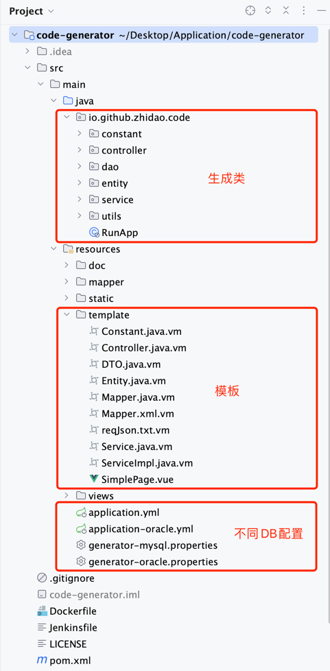
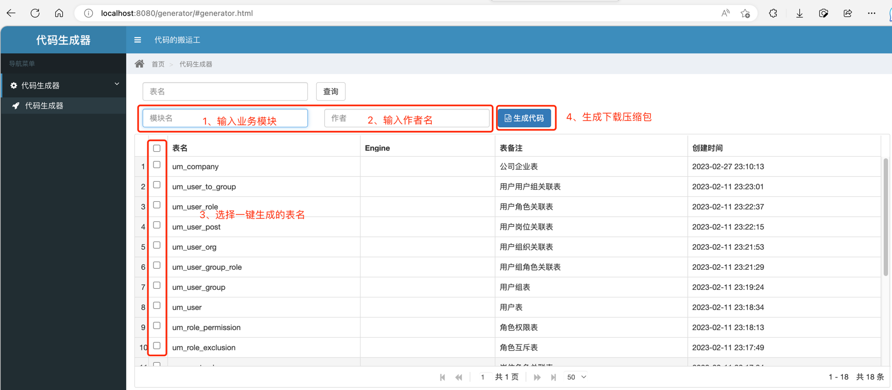
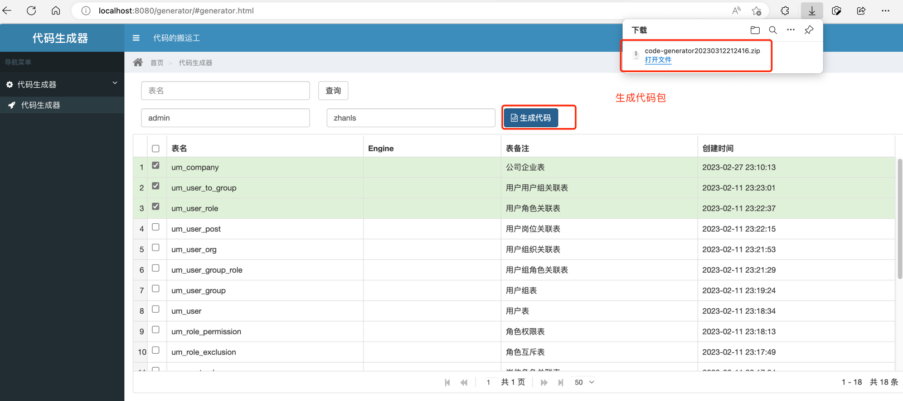
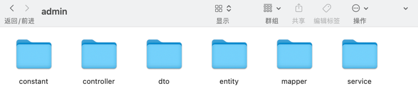

# 代码生成工具 Code Generator
> 一个后端偷懒的工具，最早是为了减少前端和后端基础功能的编写。
> 
> 工具根据表结构生成Controller/Service/Mapper/DTO/Entity后端，甚至Vue代码。
> 
> 配合后端脚手架，一键生成增删改查功能。
> 
> 工具的使用见仁见智，大家随意~

## 简介 Overview

[http://localhost:8080/generator](http://localhost:8080/generator)

## 使用 Use & 截图 Screenshot

